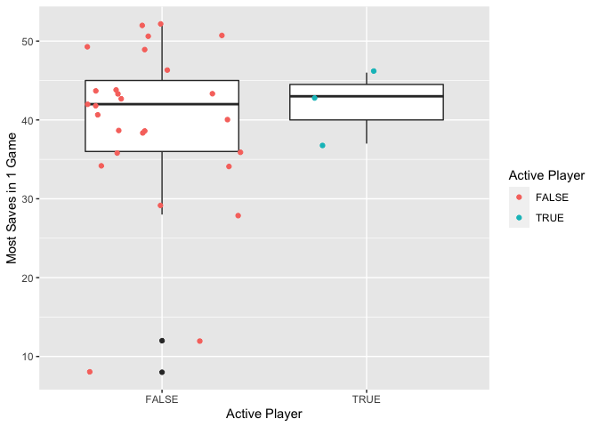

Project 1
================
Ciara Whipp
6/10/2020

## Introduction to JSON Data

### What is JSON and what is its use?

JavaScript Object Notation or
[JSON](https://www.tutorialspoint.com/json/json_overview.htm#:~:text=JSON%20or%20JavaScript%20Object%20Notation,stands%20for%20JavaScript%20Object%20Notation.)
is a text-based, data-interchangable format used to store and transport
data. It is often used to transmit data between a server and web
applications, and web services and APIs use JSON to provide data. We
will see JSON provided by an API in this document.

### Why use JSON?

JSON is language independent, so major programming languages are cable
of handling JSON data - they can get data out of JSON and turn data into
JSON. The intuitive nature of the syntax is easy to read and write, and
since the syntax is derived from and similar to existing programming
languages, it is easy for machines to generate and parse JSON data. This
[video](https://www.youtube.com/watch?v=0IoG-mSvWSo) provides a brief
overview of JSON data: what it is, advantages to JSON, and an
introduction to JSON syntax.

### R Packages to Accomodate JSON Data

There are three major R packages used to deal with JSON data:
`jsonlite`, `rjson`, and `RJSONIO`.  
Some helpful functions included in all three packages are `fromJSON()`
to convert JSON data into an R object, `toJSON()` to convert an R object
into JSON. Addtionally, `flatten` is a useful argument that creates a
single non-nested data frame from a nested data frame (common in JSON
data retrieved from the web). I will choose to use `jsonlite` since the
R documentation for this package is more robust than the doucmentation
for the other two packages.

## Retrieving Data from an API

The following code creates the base url that can be used to read in data
from the National Hockey League (NHL) API.

``` r
baseURL <- "https://records.nhl.com/site/api/"
```

The following function can be used to access the **franchise** data and
**franchise-team-totals** data. Note the `jsonlite` and `httr` packages
are required to utilize this function.

``` r
library(jsonlite)
library(httr)
overallData <- function(x){
  fullURL <- paste0(baseURL,x)
  GET(fullURL) %>% 
    content("text") %>% 
    fromJSON(flatten=TRUE) %>% 
    as_tibble()
}
```

Use the function above to return tibbles for the **franchise** data and
**franchise-team-totals** data.

``` r
overallData(x="franchise")
```

    ## # A tibble: 38 x 2
    ##    data$id $firstSeasonId $lastSeasonId $mostRecentTeam… $teamCommonName
    ##      <int>          <int>         <int>            <int> <chr>          
    ##  1       1       19171918            NA                8 Canadiens      
    ##  2       2       19171918      19171918               41 Wanderers      
    ##  3       3       19171918      19341935               45 Eagles         
    ##  4       4       19191920      19241925               37 Tigers         
    ##  5       5       19171918            NA               10 Maple Leafs    
    ##  6       6       19241925            NA                6 Bruins         
    ##  7       7       19241925      19371938               43 Maroons        
    ##  8       8       19251926      19411942               51 Americans      
    ##  9       9       19251926      19301931               39 Quakers        
    ## 10      10       19261927            NA                3 Rangers        
    ## # … with 28 more rows, and 2 more variables: $teamPlaceName <chr>, total <int>

``` r
overallData(x="franchise-team-totals")
```

    ## # A tibble: 104 x 2
    ##    data$id $activeFranchise $firstSeasonId $franchiseId $gameTypeId $gamesPlayed
    ##      <int>            <int>          <int>        <int>       <int>        <int>
    ##  1       1                1       19821983           23           2         2937
    ##  2       2                1       19821983           23           3          257
    ##  3       3                1       19721973           22           2         3732
    ##  4       4                1       19721973           22           3          272
    ##  5       5                1       19261927           10           2         6504
    ##  6       6                1       19261927           10           3          515
    ##  7       7                1       19671968           16           3          433
    ##  8       8                1       19671968           16           2         4115
    ##  9       9                1       19671968           17           2         4115
    ## 10      10                1       19671968           17           3          381
    ## # … with 94 more rows, and 25 more variables: $goalsAgainst <int>,
    ## #   $goalsFor <int>, $homeLosses <int>, $homeOvertimeLosses <int>,
    ## #   $homeTies <int>, $homeWins <int>, $lastSeasonId <int>, $losses <int>,
    ## #   $overtimeLosses <int>, $penaltyMinutes <int>, $pointPctg <dbl>,
    ## #   $points <int>, $roadLosses <int>, $roadOvertimeLosses <int>,
    ## #   $roadTies <int>, $roadWins <int>, $shootoutLosses <int>,
    ## #   $shootoutWins <int>, $shutouts <int>, $teamId <int>, $teamName <chr>,
    ## #   $ties <int>, $triCode <chr>, $wins <int>, total <int>

The following function can be used to access
**franchise-season-records**, **franchise-goalie-records**, and
**franchise-skater-records** for a specified franchise ID.

``` r
franchiseData <- function(x,ID){
  fullURL <- paste0(baseURL,x,"?cayenneExp=franchiseId=",ID)
  GET(fullURL) %>% 
    content("text") %>% 
    fromJSON(flatten=TRUE) %>% 
    as_tibble()
}
```

Use the function above to return tibbles for the Capitals franchise
(ID=24) for **franchise-season-records**, **franchise-goalie-records**,
and **franchise-skater-records**.

``` r
franchiseData(x="franchise-season-records", ID="24")
```

    ## # A tibble: 1 x 2
    ##   data$id $fewestGoals $fewestGoalsAga… $fewestGoalsAga… $fewestGoalsSea…
    ##     <int>        <int>            <int> <chr>            <chr>           
    ## 1      15          181              182 2016-17 (82)     1974-75 (80)    
    ## # … with 53 more variables: $fewestLosses <int>, $fewestLossesSeasons <chr>,
    ## #   $fewestPoints <int>, $fewestPointsSeasons <chr>, $fewestTies <int>,
    ## #   $fewestTiesSeasons <chr>, $fewestWins <int>, $fewestWinsSeasons <chr>,
    ## #   $franchiseId <int>, $franchiseName <chr>, $homeLossStreak <int>,
    ## #   $homeLossStreakDates <chr>, $homePointStreak <int>,
    ## #   $homePointStreakDates <chr>, $homeWinStreak <int>,
    ## #   $homeWinStreakDates <chr>, $homeWinlessStreak <int>,
    ## #   $homeWinlessStreakDates <chr>, $lossStreak <int>, $lossStreakDates <chr>,
    ## #   $mostGameGoals <int>, $mostGameGoalsDates <chr>, $mostGoals <int>,
    ## #   $mostGoalsAgainst <int>, $mostGoalsAgainstSeasons <chr>,
    ## #   $mostGoalsSeasons <chr>, $mostLosses <int>, $mostLossesSeasons <chr>,
    ## #   $mostPenaltyMinutes <int>, $mostPenaltyMinutesSeasons <chr>,
    ## #   $mostPoints <int>, $mostPointsSeasons <chr>, $mostShutouts <int>,
    ## #   $mostShutoutsSeasons <chr>, $mostTies <int>, $mostTiesSeasons <chr>,
    ## #   $mostWins <int>, $mostWinsSeasons <chr>, $pointStreak <int>,
    ## #   $pointStreakDates <chr>, $roadLossStreak <int>, $roadLossStreakDates <chr>,
    ## #   $roadPointStreak <int>, $roadPointStreakDates <chr>, $roadWinStreak <int>,
    ## #   $roadWinStreakDates <chr>, $roadWinlessStreak <int>,
    ## #   $roadWinlessStreakDates <chr>, $winStreak <int>, $winStreakDates <chr>,
    ## #   $winlessStreak <lgl>, $winlessStreakDates <lgl>, total <int>

``` r
franchiseData(x="franchise-goalie-records", ID="24")
```

    ## # A tibble: 30 x 2
    ##    data$id $activePlayer $firstName $franchiseId $franchiseName $gameTypeId
    ##      <int> <lgl>         <chr>             <int> <chr>                <int>
    ##  1     241 FALSE         Olie                 24 Washington Ca…           2
    ##  2     326 TRUE          Braden               24 Washington Ca…           2
    ##  3     339 FALSE         Don                  24 Washington Ca…           2
    ##  4     357 FALSE         Craig                24 Washington Ca…           2
    ##  5     468 FALSE         Gary                 24 Washington Ca…           2
    ##  6     489 FALSE         Mike                 24 Washington Ca…           2
    ##  7     494 FALSE         Ron                  24 Washington Ca…           2
    ##  8     498 FALSE         Clint                24 Washington Ca…           2
    ##  9     564 FALSE         Roger                24 Washington Ca…           2
    ## 10     648 FALSE         Mike                 24 Washington Ca…           2
    ## # … with 20 more rows, and 24 more variables: $gamesPlayed <int>,
    ## #   $lastName <chr>, $losses <int>, $mostGoalsAgainstDates <chr>,
    ## #   $mostGoalsAgainstOneGame <int>, $mostSavesDates <chr>,
    ## #   $mostSavesOneGame <int>, $mostShotsAgainstDates <chr>,
    ## #   $mostShotsAgainstOneGame <int>, $mostShutoutsOneSeason <int>,
    ## #   $mostShutoutsSeasonIds <chr>, $mostWinsOneSeason <int>,
    ## #   $mostWinsSeasonIds <chr>, $overtimeLosses <int>, $playerId <int>,
    ## #   $positionCode <chr>, $rookieGamesPlayed <int>, $rookieShutouts <int>,
    ## #   $rookieWins <int>, $seasons <int>, $shutouts <int>, $ties <int>,
    ## #   $wins <int>, total <int>

``` r
franchiseData(x="franchise-skater-records", ID="24")
```

    ## # A tibble: 509 x 2
    ##    data$id $activePlayer $assists $firstName $franchiseId $franchiseName
    ##      <int> <lgl>            <int> <chr>             <int> <chr>         
    ##  1   16910 FALSE              361 Calle                24 Washington Ca…
    ##  2   16982 TRUE               572 Alex                 24 Washington Ca…
    ##  3   17011 TRUE               684 Nicklas              24 Washington Ca…
    ##  4   17021 FALSE              375 Dale                 24 Washington Ca…
    ##  5   17075 FALSE              249 Dennis               24 Washington Ca…
    ##  6   17106 FALSE               42 Alan                 24 Washington Ca…
    ##  7   17158 FALSE              392 Mike                 24 Washington Ca…
    ##  8   17179 FALSE              259 Larry                24 Washington Ca…
    ##  9   17250 FALSE                0 Keith                24 Washington Ca…
    ## 10   17255 FALSE               98 Greg                 24 Washington Ca…
    ## # … with 499 more rows, and 25 more variables: $gameTypeId <int>,
    ## #   $gamesPlayed <int>, $goals <int>, $lastName <chr>,
    ## #   $mostAssistsGameDates <chr>, $mostAssistsOneGame <int>,
    ## #   $mostAssistsOneSeason <int>, $mostAssistsSeasonIds <chr>,
    ## #   $mostGoalsGameDates <chr>, $mostGoalsOneGame <int>,
    ## #   $mostGoalsOneSeason <int>, $mostGoalsSeasonIds <chr>,
    ## #   $mostPenaltyMinutesOneSeason <int>, $mostPenaltyMinutesSeasonIds <chr>,
    ## #   $mostPointsGameDates <chr>, $mostPointsOneGame <int>,
    ## #   $mostPointsOneSeason <int>, $mostPointsSeasonIds <chr>,
    ## #   $penaltyMinutes <int>, $playerId <int>, $points <int>, $positionCode <chr>,
    ## #   $rookiePoints <int>, $seasons <int>, total <int>

## Creating New Variables

Create a new variable for the **franchise-skater-records** data for the
Washington Capitals called goalsPerGame that gives the average number of
goals per game by dividing `goals` by `gamesPlayed`. Return a table for
the top 6 goals per game
statistic.

``` r
skaterCaps <- franchiseData(x="franchise-skater-records", ID="24")$data %>% 
  rename("Last Name"=lastName, "Position Code"=positionCode, "Number of Seasons Played"=seasons) %>%
  mutate("Goals per Game"=goals/gamesPlayed) %>% 
  select(`Last Name`, `Position Code`, `Goals per Game`, `Number of Seasons Played`) %>% 
  arrange(desc(`Goals per Game`))
knitr::kable(head(skaterCaps), digits=2)
```

| Last Name  | Position Code | Goals per Game | Number of Seasons Played |
| :--------- | :------------ | -------------: | -----------------------: |
| Ovechkin   | L             |           0.61 |                       15 |
| Berezin    | L             |           0.56 |                        1 |
| Maruk      | C             |           0.53 |                        5 |
| Gartner    | R             |           0.52 |                       10 |
| Ciccarelli | R             |           0.50 |                        4 |
| Carlson    | D             |           0.50 |                        1 |

## Numeric Summaries

### Contingency Tables

Continuing with the **franchise-skater-records** data for the Washington
Capitals, create a contingency table that give the counts for each
position code based on active status.

``` r
skaterCaps <- franchiseData(x="franchise-skater-records", ID="24")$data
knitr::kable(table(skaterCaps$activePlayer, skaterCaps$positionCode), 
             caption="Active Status and Position Code Information for the Capitals")
```

|       |   C |   D |  L |  R |
| ----- | --: | --: | -: | -: |
| FALSE | 108 | 159 | 91 | 99 |
| TRUE  |  12 |  19 | 12 |  9 |

Active Status and Position Code Information for the Capitals

Using the **franchise-goalie-records** data for the Washington Capitals,
change the values of `mostGoalsAgainstOneGame` to “Good/Fair
Performance” for 4 or less goals, “Poor Performance” for 5-8 goals,
and “Terrible Performance” for more than 8 goals to represent Goalie
Performance, and change the values of `wins` to “Winning Goalie” for
goalies with greater than or equal to 175 wins and to “Losing Goalie”
for goalies with less than 175 wins to represent Winnning Status. The
contingency tables show Goalie Performance and Winning status for
non-active and active Capitals’ goalies.

``` r
goalieData<-franchiseData(x="franchise-goalie-records", ID="24")$data
x<-goalieData$mostGoalsAgainstOneGame
goalieData$mostGoalsAgainstOneGame <- ifelse(x<=4, "Good/Fair Performance",ifelse(x>8, "Terrible Performance", "Poor Performance"))
y<-goalieData$wins
goalieData$wins <- ifelse(y<175, "Losing Goalie","Winning Goalie")
notActive <- goalieData %>% 
  filter(activePlayer == FALSE)
knitr::kable(table(notActive$mostGoalsAgainstOneGame, notActive$wins), 
             caption="Goalie Performance and Winning Status for Non-Active Goalies")
```

|                       | Losing Goalie | Winning Goalie |
| --------------------- | ------------: | -------------: |
| Good/Fair Performance |             5 |              0 |
| Poor Performance      |            17 |              1 |
| Terrible Performance  |             4 |              0 |

Goalie Performance and Winning Status for Non-Active Goalies

``` r
active <- goalieData %>% 
  filter(activePlayer ==TRUE)
knitr::kable(table(active$mostGoalsAgainstOneGame, active$wins), 
             caption="Goalie Performance and Winning Status for Active Goalies")
```

|                       | Losing Goalie | Winning Goalie |
| --------------------- | ------------: | -------------: |
| Good/Fair Performance |             1 |              0 |
| Poor Performance      |             1 |              1 |

Goalie Performance and Winning Status for Active Goalies

### Summary Statistics Tables

The tables below give summary statisitics for non-active and active
Capitals’ goalies (minimum, 1st quantile, median, mean, 3rd quantile,
and maximum) for `mostSavesOneGame`, `mostShotsAgainstOneGame`,
`mostWinsOneSeason`, and `seasons`.

``` r
notActive <- notActive %>%
  select(mostSavesOneGame, mostShotsAgainstOneGame,
         mostWinsOneSeason, seasons) %>%
  rename("Most Saves in 1 Game"=mostSavesOneGame, 
         "Most Shots Against in 1 Game"=mostShotsAgainstOneGame, 
         "Most Wins in 1 Season"=mostWinsOneSeason,
         "Seasons"=seasons)
knitr::kable(apply(notActive,2,summary), digits=1,
             caption="Summary of Non-Active Capitals' Goalies")
```

|         | Most Saves in 1 Game | Most Shots Against in 1 Game | Most Wins in 1 Season | Seasons |
| ------- | -------------------: | ---------------------------: | --------------------: | ------: |
| Min.    |                  8.0 |                          8.0 |                   0.0 |     1.0 |
| 1st Qu. |                 36.0 |                         39.5 |                   3.5 |     2.0 |
| Median  |                 42.0 |                         45.0 |                  14.0 |     2.0 |
| Mean    |                 39.4 |                         42.9 |                  15.3 |     3.2 |
| 3rd Qu. |                 45.0 |                         49.0 |                  24.5 |     4.0 |
| Max.    |                 52.0 |                         62.0 |                  41.0 |    16.0 |

Summary of Non-Active Capitals’ Goalies

``` r
active <- active %>%
    select(mostSavesOneGame, mostShotsAgainstOneGame,
         mostWinsOneSeason, seasons) %>%
    rename("Most Saves in 1 Game"=mostSavesOneGame, 
         "Most Shots Against in 1 Game"=mostShotsAgainstOneGame, 
         "Most Wins in 1 Season"=mostWinsOneSeason,
         "Seasons"=seasons)
knitr::kable(apply(active,2,summary), 
             caption="Summary of Active Capitals' Goalies")
```

|         | Most Saves in 1 Game | Most Shots Against in 1 Game | Most Wins in 1 Season | Seasons |
| ------- | -------------------: | ---------------------------: | --------------------: | ------: |
| Min.    |                 37.0 |                         40.0 |                   5.0 |     1.0 |
| 1st Qu. |                 40.0 |                         42.5 |                  10.5 |     1.0 |
| Median  |                 43.0 |                         45.0 |                  16.0 |     1.0 |
| Mean    |                 42.0 |                         44.0 |                  23.0 |     4.0 |
| 3rd Qu. |                 44.5 |                         46.0 |                  32.0 |     5.5 |
| Max.    |                 46.0 |                         47.0 |                  48.0 |    10.0 |

Summary of Active Capitals’ Goalies

## Visuals

Using the `goalieData` from the tables above, create various types of
plots to visualize the data.

### Bar Plots

#### One Variable Bar Plots

The bar plots below represent the counts of Non-active and Active
Goalies, of Goalie Perforamance, and Winning Status, respectively.

``` r
g <- ggplot(goalieData)
g + geom_bar(aes(x=activePlayer)) + 
  labs(x="Player Active")
```

<!-- -->

``` r
g + geom_bar(aes(x=mostGoalsAgainstOneGame)) + 
  labs(x="Goalie Performance")
```

<!-- -->

``` r
g + geom_bar(aes(x=wins)) +
  labs(x="Winning Status")
```

<!-- -->

#### Two Variable Side-by-Side Bar Plots

The first bar plot is a visual representation of the number of Active
and Non-Active Goalies for each Goal Performance category. The second
bar plot is a visual respresentation fo the number of active and
non-active goalies for Winning Goalies and Losing
Goalies.

``` r
g + geom_bar(aes(x=mostGoalsAgainstOneGame, fill=as.factor(activePlayer)),
             position="dodge") +
  labs(x="Goalie Performance") +
  scale_fill_discrete(name="Active Player")
```

<!-- -->

``` r
g + geom_bar(aes(x=wins, fill=as.factor(activePlayer)),
             position="dodge") +
  labs(x="Winning Status") +
  scale_fill_discrete(name="Active Player")
```

<!-- -->

#### Three Variable Side-by-Side Bar Plot

The following bar plots give a visual representation of the number of
Winning Goalies and Losing Goalies for Active and Non-Active Goalies for
each Goalie Performance
category.

``` r
g + geom_bar(aes(x=activePlayer, fill=as.factor(wins)), position="dodge") +
  labs(x="Active Player") +
  scale_fill_discrete("Winning Status") +
  facet_wrap(~ mostGoalsAgainstOneGame)
```

<!-- -->

### Box Plots

The following box plot gives visual representation and comparison of the
summary statistics for Most Saves in One Game for Active and Non-Active
Goalies.

``` r
g <- ggplot(goalieData, aes(x=activePlayer, y=mostSavesOneGame))
g + geom_boxplot() +
  geom_point(aes(x=activePlayer, y=mostSavesOneGame,
                 color=activePlayer),position="jitter") +
  scale_color_discrete(name="Active Player") +
  labs(x="Active Player", y="Most Saves in 1 Game")
```

<!-- -->

The following box plot gives visual representation and comparison of the
summary statistics for Most Wins in One Season for Winning Goalies and
Losing Goalies.

``` r
g <- ggplot(goalieData, aes(x=wins, y=mostWinsOneSeason))
g + geom_boxplot() +
  geom_point(aes(x=wins, y=mostWinsOneSeason,
                 color=wins),position="jitter") +
  scale_color_discrete(name="Winning Status") +
  labs(x="Winning Status", y="Most Wins in 1 Season")
```

<!-- -->

### Scatter Plots
